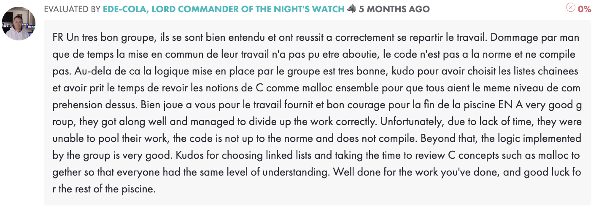

## Hi there 👋 i'm Antoine Cohaut

I'm currently a student at 42 Paris !  
<ins>login</ins> : _acohaut_  

### 🌱 About me
I come from the south of France, near Marseille, in Provence. I moved to Paris in 2019 to study. I starded at university, where I studied Cinéma and discovered computer science and Python (thanks to a college option). I continued with a private film school before changing direction and take part in the "competitive examination" (the "piscine") for 42 Paris. 
Now i'm gradually learning to become a software engineer !

### 📍 My links
[linkedin](https://www.linkedin.com/in/antoine-cohaut-879401271/)
[youtube](https://www.youtube.com/@antoinecohaut)
[instagram](https://www.instagram.com/antoine.cohaut/?hl=fr)

  

## My 42 Journey (so far)  

### 🏊 Piscine  

<ins>date</ins> : ***september 2025***

#### Days
- [sh 00](https://github.com/DisSaith/42-Piscine/tree/main/sh00) - ***65/100*** ✅
- [sh 01](https://github.com/DisSaith/42-Piscine/tree/main/sh01) - ***60/100*** ✅
- [c 00](https://github.com/DisSaith/42-Piscine/tree/main/c00) - ***70/100*** ✅
- [c 01](https://github.com/DisSaith/42-Piscine/tree/main/c01)​ - ***100/100*** ✅
- [c 02](https://github.com/DisSaith/42-Piscine/tree/main/c02) - ***85/100*** ✅
- [c 03](https://github.com/DisSaith/42-Piscine/tree/main/c03) - ***100/100*** ✅
- [c 04](https://github.com/DisSaith/42-Piscine/tree/main/c04)​ - ***100/100*** ✅
- [c 05](https://github.com/DisSaith/42-Piscine/tree/main/c05)​ - ***80/100*** ✅
- [c 06](https://github.com/DisSaith/42-Piscine/tree/main/c06)​ - ***100/100*** ✅
- [c 07](https://github.com/DisSaith/42-Piscine/tree/main/c07) -​ ***100/100*** ✅
- [c 08](https://github.com/DisSaith/42-Piscine/tree/main/c08) -​ ***100/100*** ✅
- [c 09](https://github.com/DisSaith/42-Piscine/tree/main/c09)​ - ***100/100*** ✅
- [c 10](https://github.com/DisSaith/42-Piscine/tree/main/c10) -​ ***15/100*** ❌
- [c 11](https://github.com/DisSaith/42-Piscine/tree/main/c11) -​ ***50/100*** ✅

#### Rushs
- [rush 00](https://github.com/DisSaith/42-Piscine/tree/main/rush00) - ***0/100***  ❌  
  

- [rush 01](https://github.com/DisSaith/42-Piscine/tree/main/rush01) - ***0/100*** ❌  
  

- [rush 02](https://github.com/DisSaith/42-Piscine/tree/main/rush02) - ***0/100*** ❌  
  

#### Exams
- exam 00 - ***100/100*** ✅
- exam 01 - ***80/100*** ✅
- exam 02 - ***80/100*** ✅
- exam final - ***84/100*** ✅

<ins>final level</ins> : ***9,69***  
  

### 👨🏻‍💻 Common Core
<ins>since</ins> : ***november 2025***   

#### Milestone 00
- [libft](https://github.com/DisSaith/42-Common-Core/tree/main/00_libft) - Your very first own library coded in C - ***125/100*** ✅ (validated 11/10/2025)
#### Milestone 01
- born2beroot - Create and setting up a Virtual Machine - ***100/100*** ✅ (validated 11/12/2025)
- [ft_printf](https://github.com/DisSaith/42-Common-Core/tree/main/01_ft_printf) - Recode the function printf() - ***110/100*** ✅ (validated 11/17/2025)
- [get_next_line](https://github.com/DisSaith/42-Common-Core/tree/main/01_get_next_line) - Create a function that returns a line read from a file descriptor - ***125/100*** ✅ (validated 11/19/2025)
#### Milestone 02
- [push_swap](https://github.com/DisSaith/42-Common-Core/tree/main/02_push_swap) - Sort a data stack with a limited set of instructions - ***84/100*** ✅ (validated 12/11/2025)
- [pipex](https://github.com/DisSaith/42-Common-Core/tree/main/02_pipex) - Explore Unix mechanism in detail and understand processes and pipes (shell) - ***100/100*** ✅ (validated 01/02/2026)
- [so_long](https://github.com/DisSaith/42-Common-Core/tree/main/02_so_long) - Create a small 2D game with minilibx - ***125/100*** ✅ (validated 01/09/2026)
#### Milestone 03
- [philosophers](https://github.com/DisSaith/42-Common-Core/tree/main/03_philosophers) - Learn the basics of threading a process (dining philosophers problem) - ***100/100*** ✅ (validated 01/20/2026)
- minishell - Reproduce a simple bash shell - ***current project*** ⏳
#### Milestone 04
not yet..

<!--
**DisSaith/DisSaith** is a ✨ _special_ ✨ repository because its `README.md` (this file) appears on your GitHub profile.

Here are some ideas to get you started:

- 🔭 I’m currently working on ...
- 🌱 I’m currently learning ...
- 👯 I’m looking to collaborate on ...
- 🤔 I’m looking for help with ...
- 💬 Ask me about ...
- 📫 How to reach me: ...
- 😄 Pronouns: ...
- ⚡ Fun fact: ...
-->
